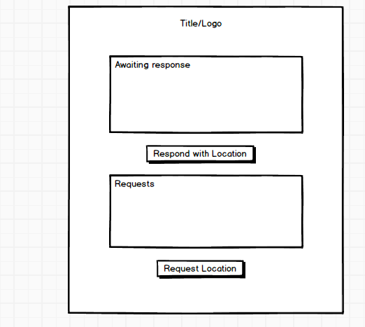

### Where art thou?

#### Background

Geolocation is a powerfully communicative tool, especially in the mobile market
where users often find themselves in unfamiliar locales with only their mobile device
to clarify where they are. This app seeks to utilize geo-location based functionality
by giving mobile users an easy way to share their location with others on request.  This app will help allow parents to set boundaries for where there kids are allowed to go.

#### Functionality & MVP

With this app, users will be able to:

- [ ] Use react-native geolocation to pinpoint exactly where the user is
- [ ] Allow other users set boundaries using react native geofencing
- [ ] Send out text if position is out of the set bounds using react-native communications
- [ ] Be able to send text message response with location to requesting user
- [ ] Mobile app with UI/UX in mind
- [ ] iOS application

Wireframe

#### Technologies & Technical Challenges
This app will be implemented using JavaScript and React Native.  In addition to the webpack.config.js and package.json files, there will be one script:

- app.js : will contain the rerendering of requests and emergency contacts
- geofence_input_form.js
- text_response.js
- contacts_form.js
- warning.js

The primary technical challenges will be:

- Learning React Native
- Implementing the react-native geolocation API
- Implement geofence API
- Converting response to text message

#### Group Members & Work Breakdown
Our group consists of two members, Scott Mosher and Dallas Morgan.

Scott's primary responsibilities will be:
- research react native components
- learn the integration of text API
- frontend styling

Dallas' primary responsibilities will be:
- setting up backend for users and sessions
- integration of react-native geolocation API
- coordinating AJAX requests to server

#### Implementation Timeline
###### Day 1: Get started learning the basics of React Native and how it interacts with the backend
- research react native(Scott)
- setup package.json(Scott)
- setup rails backend (Dallas)

###### Day 2: Work on integrating react-native geolocation and research text API
- begin basic views for React Native(Scott)
- get location to pop up on the views(Dallas)

###### Day 3: Work on sending out requests to other users
- get requests to specific users(Scott)
- be able to respond with location(Dallas)

###### Day 4: Work on integrating text API
- be able to respond and request with text messages(Dallas)
- begin styling(Scott)

###### Day 5: Style and test for bugs
- finish view styling(Scott)
- ensure smooth usability(Dallas)

#### Future Plans
- Implement yelp API for more detailed responses
- Allow user to turn on location sharing
- Implement panic button
